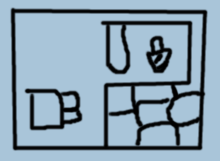

LA-MULANA
=========

## Gate of Guidance

Offer 3 lights to the heavens

"two brave Souls"  
"Quiet solitude"  
"A rock that reaches a high place"  
what is this brave soul?

Watchtower soars above the **temple of the sun**:  
* traps  
* key hidden in new wall

There are 8 Ankhs  
protect the gerat spirits  
Seek the red light - ankh jewel (to open the ankhs)  
The guardians that slumber within will test my strength  
  
* Ankh of Gate of Guidance lies beyond the **path of the gazing faces**  
* Jewel at the foot of the **Cliff of Radiance**

Ages of the sun  
1st destroyed by flood  
2nd god of wind  
3rd god of fire  
4th blood and fire falling

Chi You, demon  
**Sacrificial abyss**  


---
## Mausoleum of the Giants

Cross the sacred lake  


Those who plunder  
the red l     . [light?]  
shall never escape  


Children, youngest to oldest
```
1. Zebu       Snake                                               
2. Bado       Large    Blanket of countless stars, deep slumber
3. Migela     Soared
4. Ledo       Fish                Sun shone, Hole in chest, key
5. Futo       Wisdom              Strength at his feet
6. Abuto      Born of earth
7. Ji         Cast mother away    Started praying on moonlit night
8. Ribu       Did not know mother
9. Sakit      
```
Spirit of the 9th in body of 0

Abuto, Ji, Ribu, and Sakit all hoped there  
would come a day  
when the mother would live in this land.

Nebra Sky Disk lies beneath this land, jump on it from high above.

---
## Temple of the Sun

A **statue of the Giant** waits in the **land of inferno**  
The words of the spirit are hiddin within but wait for them to present themselves.